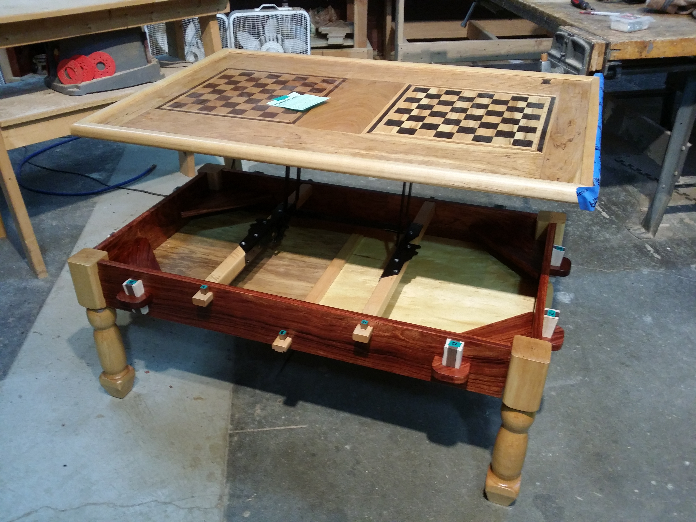

# Chessboard Coffee Table

> *A segmented-construction wooden coffee table with an inlaid chessboard playing surface, built as a personal woodworking project.*

*Chessboard coffee table during shop finishing: two inlaid playing surfaces set into a large hardwood top, with contrasting square colors and a broad surrounding field.*

## What this is

A personal woodworking project: a coffee table with a chessboard inlaid into the top, built using segmented construction with contrasting hardwoods.

This is a portfolio piece for the segmented-woodworking technique — the same family of methods used for segmented woodturning, scaled up to a flat-panel furniture surface. The chessboard inlay required precise dimensional control across 64 squares of two contrasting woods, with clean transitions between squares and consistent grain orientation.

Related repositories: [`woodworking`](https://github.com/tonykoop/woodworking) for the broader shop context, and [`ashiko-drum-workshop`](https://github.com/tonykoop/ashiko-drum-workshop) for a very different segmented-construction problem built around stave geometry instead of flat-panel inlay.

## What you'll find

- Build photos
- Wood selection and dimensional notes
- Segment-glue-up sequence
- Finishing schedule

> *(Forthcoming.)*

*Mid-build, September 2015: hand-planing the assembled chessboard panel flat with a No. 5 jack plane. After 64 segmented squares are glued up, the surface has minute height variations at every seam — hand-planing across the panel is the only reliable way to bring it to a single plane without sanding through the thin contrast veneers.*

## Engineering notes

The chessboard square geometry, while visually simple, is dimensionally demanding:
- **8 × 8 = 64 squares** with two-color alternation
- **Cumulative dimensional error** is the enemy: by square 8, a 0.5mm-per-square error has compounded to 4mm of misalignment
- **Wood movement** in two contrasting species at different humidities is not always the same; the substrate has to absorb that
- **Grain orientation** affects both visual quality and long-term stability

This is the kind of project that sounds simple until you build one.

## License

Released under [CC-BY 4.0](LICENSE) — personal project, free to reuse and adapt with credit.

## Status

| Section | Status |
|---|---|
| Repo description, license, gitignore | ✓ done |
| Build narrative | forthcoming |
| Wood selection notes | forthcoming |
| Segment dimensions | forthcoming |
| Finishing schedule | forthcoming |
| Hero photo | forthcoming |
